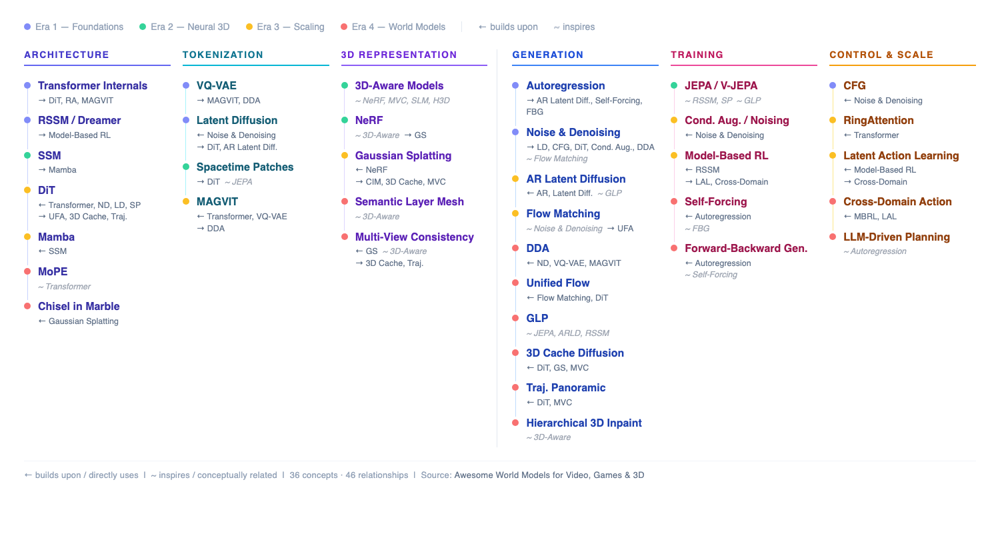

# World Model Wiki

A curated glossary of key concepts behind world models, explained in plain language. Entries are grouped into four eras that roughly trace how the field evolved.

---

<table>
<tr><th>Era</th><th>Category</th><th>Term</th><th>What it does</th></tr>
<tr><td rowspan="7"><strong>1 — Foundations</strong><br>(pre-2020)</td><td>Architecture</td><td><a href="#transformer-internals-attention-mlp-layernorm">Transformer Internals</a></td><td>Attention + MLP + LayerNorm = one Transformer block</td></tr>
<tr><td>Architecture</td><td><a href="#rssm-recurrent-state-space-model">RSSM</a></td><td>The original world model architecture — learn, imagine, plan</td></tr>
<tr><td>Tokenization</td><td><a href="#vq-vae-vector-quantized-vae">VQ-VAE</a></td><td>Compress images into discrete codebook tokens</td></tr>
<tr><td>Tokenization</td><td><a href="#latent-diffusion-kl-vae">Latent Diffusion (KL-VAE)</a></td><td>Compress images into continuous latents for diffusion</td></tr>
<tr><td>Generation</td><td><a href="#autoregression">Autoregression</a></td><td>Predict next token from all previous tokens</td></tr>
<tr><td>Generation</td><td><a href="#noise--denoising">Noise &amp; Denoising</a></td><td>Iteratively remove noise to generate clean output</td></tr>
<tr><td>Control</td><td><a href="#classifier-free-guidance-cfg">Classifier-Free Guidance</a></td><td>Amplify prompt adherence at inference time</td></tr>
<tr><td rowspan="5"><strong>2 — Neural 3D</strong><br>(2020-2022)</td><td>Architecture</td><td><a href="#ssm-state-space-model">SSM</a></td><td>Models temporal dynamics with linear cost</td></tr>
<tr><td>Tokenization</td><td><a href="#spacetime-patches">Spacetime Patches</a></td><td>Splits video into space+time cubes</td></tr>
<tr><td>3D representation</td><td><a href="#3d-aware-models">3D-Aware Models</a></td><td>Understands spatial geometry and depth</td></tr>
<tr><td>3D representation</td><td><a href="#nerf-neural-radiance-fields">NeRF</a></td><td>Neural function encoding a 3D scene</td></tr>
<tr><td>Training</td><td><a href="#jepa--v-jepa-joint-embedding-predictive-architecture">JEPA / V-JEPA</a></td><td>Predict future in representation space, not pixels</td></tr>
<tr><td rowspan="10"><strong>3 — Scaling Era</strong><br>(2023-2024)</td><td>Architecture</td><td><a href="#diffusion-transformer-dit">DiT</a></td><td>Scales diffusion with transformers</td></tr>
<tr><td>Architecture</td><td><a href="#mamba">Mamba</a></td><td>Input-dependent SSM with linear cost</td></tr>
<tr><td>Tokenization</td><td><a href="#magvit-video-tokenization">MAGVIT</a></td><td>Tokenize video for transformer generation</td></tr>
<tr><td>3D representation</td><td><a href="#gaussian-splatting">Gaussian Splatting</a></td><td>Real-time renderable 3D via tiny blobs</td></tr>
<tr><td>Generation</td><td><a href="#autoregressive-latent-diffusion">Autoregressive Latent Diffusion</a></td><td>Sequential generation + diffusion refinement</td></tr>
<tr><td>Generation</td><td><a href="#flow-matching">Flow Matching</a></td><td>Straight-line noise-to-data transport, fewer steps</td></tr>
<tr><td>Training</td><td><a href="#conditioning-augmentation-vs-dynamic-noising">Conditioning Aug. vs Dynamic Noising</a></td><td>Adapt conditioning and noise for stable training</td></tr>
<tr><td>Training</td><td><a href="#model-based-reinforcement-learning">Model-Based RL</a></td><td>Learn a world model, then plan inside it</td></tr>
<tr><td>Control</td><td><a href="#latent-action-learning-how-genie-learns-controls">Latent Action Learning</a></td><td>Discover actions from unlabeled video</td></tr>
<tr><td>Scaling</td><td><a href="#ringattention">RingAttention</a></td><td>Distribute attention across GPUs for 1M+ tokens</td></tr>
<tr><td rowspan="14"><strong>4 — World Models</strong><br>(2025-2026)</td><td>Architecture</td><td><a href="#mixture-of-physics-experts-mope">MoPE</a></td><td>Specialized physics modules with routing</td></tr>
<tr><td>Architecture</td><td><a href="#chisel-in-marble">Chisel in Marble</a></td><td>Decouples 3D structure from style</td></tr>
<tr><td>3D representation</td><td><a href="#semantically-layered-3d-mesh">Semantically Layered 3D Mesh</a></td><td>Mesh organized into labeled object layers</td></tr>
<tr><td>3D representation</td><td><a href="#multi-view-consistency">Multi-View Consistency</a></td><td>All camera angles agree on geometry</td></tr>
<tr><td>Generation</td><td><a href="#discrete-diffusion-adaptation-dda">DDA</a></td><td>Diffusion over discrete tokens</td></tr>
<tr><td>Generation</td><td><a href="#unified-flow-architecture">Unified Flow Architecture</a></td><td>Continuous noise-to-data transformation</td></tr>
<tr><td>Generation</td><td><a href="#generative-latent-prediction-glp">GLP</a></td><td>Predict future in latent space, then decode</td></tr>
<tr><td>Generation</td><td><a href="#3d-cache-conditioned-video-diffusion">3D Cache Conditioned Video Diffusion</a></td><td>3D scene guides 2D diffusion</td></tr>
<tr><td>Generation</td><td><a href="#trajectory-guided-panoramic-video-diffusion">Traj. Panoramic Video Diffusion</a></td><td>360-degree video following a camera path</td></tr>
<tr><td>Generation</td><td><a href="#hierarchical-3d-block-inpainting">Hierarchical 3D Block Inpainting</a></td><td>Fill 3D scenes coarse-to-fine</td></tr>
<tr><td>Training</td><td><a href="#self-forcing">Self-Forcing</a></td><td>Train on own predictions to reduce drift</td></tr>
<tr><td>Training</td><td><a href="#forward-backward-generation">Forward-Backward Generation</a></td><td>Enforce consistency in both time directions</td></tr>
<tr><td>Control</td><td><a href="#cross-domain-action-conditioning">Cross-Domain Action Conditioning</a></td><td>Actions that generalize across environments</td></tr>
<tr><td>Planning</td><td><a href="#llm-driven-procedural-planning">LLM-Driven Procedural Planning</a></td><td>LLM generates action plans for agents</td></tr>
</table>



---

# Era 1 — Foundations (pre-2020)

## Transformer Internals (Attention, MLP, LayerNorm)

> The three building blocks inside every Transformer layer — attention communicates between tokens, MLP transforms each token, LayerNorm keeps training stable.

**Category:** Architecture | **Key papers:** Vaswani et al. 2017 ("Attention Is All You Need") | **Related:** [DiT](#diffusion-transformer-dit), [RingAttention](#ringattention)

```
Attention(Q, K, V) = softmax(Q × Kᵀ / √d) × V
```

> **Read it as:** Each token (Q = query) asks "how relevant is every other token (K = key) to me?" The scores are normalized (softmax), then used to create a weighted blend of token values (V). Division by `√d` prevents the scores from getting too large.

Every Transformer-based model (GPT, Sora, DiT, most world models) is built from repeated blocks containing these three components.

### How it works

```
input tokens
      |
      v
LayerNorm --> Multi-Head Attention --> residual connection
      |
      v
LayerNorm --> MLP --> residual connection
      |
      v
output tokens
```

**Multi-Head Attention:** Each token asks "which other tokens should I pay attention to?" Multiple attention heads run in parallel, each focusing on different patterns (spatial layout, object relationships, color, etc.).

```
MultiHead(Q, K, V) = Concat(head₁, head₂, ..., headₙ) × W_out
where headᵢ     = Attention(Q × Wᵢ_Q,  K × Wᵢ_K,  V × Wᵢ_V)
```

> **Read it as:** The input is projected into `n` separate subspaces (one per head), each with its own learned weights `Wᵢ`. Each head runs the attention formula independently — one head might learn spatial layout, another object relationships. The results are concatenated and projected back to the original dimension.

**MLP (Feed-Forward Network):** After attention mixes information *between* tokens, the MLP transforms information *within* each token.

```
MLP(x) = W₂ × ReLU(W₁ × x + b₁) + b₂
```

> **Read it as:** Each token `x` is expanded to a wider dimension by `W₁` (e.g., 768 -> 3072), passed through a nonlinearity (ReLU — zeroes out negatives, keeps positives), then compressed back by `W₂` (3072 -> 768). This lets the network learn complex per-token transformations that pure attention can't capture.

**LayerNorm:** Normalizes values at every layer to prevent **gradient explosion** — where gradients grow exponentially during training, causing weights to update too aggressively and loss to spike to NaN.

```
LayerNorm(x) = γ × (x - μ) / √(σ² + ε) + β
```

> **Read it as:** For each token, subtract its mean `μ`, divide by its standard deviation `σ` (with a tiny `ε` to avoid dividing by zero), then rescale with learned parameters `γ` and `β`. This keeps values in a stable range so gradients don't explode or vanish across deep stacks of layers.

| Component | Role |
| --- | --- |
| Attention | Communication between tokens |
| MLP | Feature transformation within each token |
| LayerNorm | Training stability |

### Why it matters for world models

This is the engine inside DiT, Sora, Genie, and most modern world models. When a world model paper says "Transformer blocks," they mean this stack repeated dozens or hundreds of times.

### Quick analogy

A team meeting:
- **Attention** = everyone listens to each other and decides who has useful info
- **MLP** = each person goes back to their desk and updates their own understanding
- **LayerNorm** = keeps everyone speaking at similar volume so no one drowns out the room

---

## RSSM (Recurrent State Space Model)

> The original "world model" architecture — learns a compact mental model of an environment from pixels, then imagines future states to plan actions without acting in the real world.

**Category:** Architecture | **Key papers:** Ha & Schmidhuber 2018 ("World Models"), PlaNet (Hafner et al. 2019), Dreamer (Hafner et al. 2020) | **Related:** [SSM](#ssm-state-space-model), [Model-Based RL](#model-based-reinforcement-learning)

```
h_t    = f(h_(t-1), s_(t-1), a_(t-1))          (deterministic path)
s_t    ~ q(s_t | h_t, o_t)                      (stochastic state from observation)
ŝ_t   ~ p(s_t | h_t)                            (stochastic state from imagination)
ô_t   = decode(h_t, s_t)                        (reconstruct observation)
```

> **Read it as:** The deterministic recurrent state `h_t` summarizes history. The stochastic state `s_t` captures uncertainty — inferred from actual observations during training (`q`), or imagined from the model alone during planning (`p`). Together they form a compact world state. The decoder reconstructs what the agent would see.

RSSM (Hafner et al., 2019) combines a deterministic RNN path with a stochastic state variable, creating a model that can both *remember* (deterministic) and *imagine under uncertainty* (stochastic). This is the architecture inside PlaNet, Dreamer, DreamerV2, and DreamerV3.

### How it works

```
observation (pixels)
       |
       v
encoder --> stochastic state (what's uncertain)
       +
deterministic state (what's remembered from history)
       |
       v
world state = (h_t, s_t)
       |
       +--> reward predictor (how good is this state?)
       +--> observation decoder (what would I see?)
       +--> continue predictor (is the episode over?)
```

During planning, the agent *imagines* thousands of future trajectories using only the learned model — no real environment interaction needed:

```
current state --> imagine action A --> predict state' --> predict state'' --> ...
                  imagine action B --> predict state' --> predict state'' --> ...
                  pick the trajectory with highest predicted reward
```

| Model | Year | Key advance |
| --- | --- | --- |
| World Models (Ha & Schmidhuber) | 2018 | VAE + RNN to learn environment dynamics |
| PlaNet | 2019 | RSSM with latent planning |
| Dreamer | 2020 | Backpropagation through imagined trajectories |
| DreamerV3 | 2023 | Scales to Minecraft, Atari, robotics without tuning |

### Why it matters for world models

RSSM is the intellectual origin of modern world models. The core idea — *learn a compressed model of the world, then use it to imagine and plan* — is exactly what today's video world models do at scale. Dreamer proved this works across diverse environments; Sora, Genie, and Cosmos scaled the same intuition with diffusion and transformers.

### Quick analogy

A chess player who doesn't need to move pieces to think ahead. They hold a mental model of the board (RSSM), imagine possible moves (planning in latent space), and pick the best sequence — all "in their head."

---

## VQ-VAE (Vector Quantized VAE)

> Compresses images into discrete tokens (like words) using a learned codebook, so transformers can generate images the same way GPT generates text.

**Category:** Tokenization | **Key papers:** van den Oord et al. 2017 | **Key models:** DALL-E, Oasis | **Related:** [MAGVIT](#magvit-video-tokenization), [DDA](#discrete-diffusion-adaptation-dda)

```
z_q = argmin_eₖ ‖z_e - eₖ‖²       for k = 1, ..., K
```

> **Read it as:** The encoder outputs a continuous vector `z_e`. We find the closest codebook entry `eₖ` (out of K total entries) and snap to it. The result `z_q` is a discrete token index. This is the "vector quantization" step.

VQ-VAE takes a continuous image and converts it into a sequence of discrete token IDs by snapping each encoded vector to its nearest entry in a learned codebook.

### How it works

```
image
  |
  v
encoder (compress to continuous vectors)
  |
  v
vector quantization (snap each vector to nearest codebook entry)
  |
  v
discrete tokens:  [14, 52, 18, 92, ...]
  |
  v
decoder (reconstruct image from tokens)
```

### Why it matters for world models

Once images or video are tokens, all the scaling infrastructure from language models (transformers, attention, large-scale training) applies directly. VQ-VAE is the foundation of visual tokenization used in DALL-E, Oasis, and many game world models.

### Quick analogy

Translating a painting into numbered color swatches from a fixed palette. A language model can then learn to write new swatch sequences that decode into new paintings.

---

## Latent Diffusion (KL-VAE)

> Compress images into a continuous latent space with a KL-regularized VAE, then run diffusion there instead of on raw pixels — faster training, lower memory, same quality.

**Category:** Tokenization | **Key papers:** Rombach et al. 2022 ("High-Resolution Image Synthesis with Latent Diffusion Models") | **Key models:** Stable Diffusion, Sora, DIAMOND, Cosmos | **Related:** [VQ-VAE](#vq-vae-vector-quantized-vae), [Noise & Denoising](#noise--denoising), [DiT](#diffusion-transformer-dit)

```
z = Encoder(x)           z ∈ ℝ^(h×w×c)       (continuous latent)
L_KL = KL(q(z|x) ‖ p(z))                      (regularization)
x̂ = Decoder(z)                                 (reconstruction)
```

> **Read it as:** The encoder compresses an image `x` into a continuous latent `z` (much smaller than the original — e.g., 512×512×3 → 64×64×4). KL divergence keeps the latent space smooth and well-structured. The decoder reconstructs the image. Diffusion then operates entirely in this small `z` space.

[VQ-VAE](#vq-vae-vector-quantized-vae) compresses to discrete tokens (integers). KL-VAE compresses to continuous vectors (floats). Most diffusion-based world models use the continuous path because diffusion naturally operates on continuous values — you can't add Gaussian noise to a token ID, but you can add it to a latent vector.

### How it works

```
Pixel-space diffusion (slow):
  512×512×3 image --> add noise --> denoise --> 786,432 values per step

Latent diffusion (fast):
  512×512×3 image --> encode --> 64×64×4 latent --> add noise --> denoise --> 16,384 values per step
                                                                                    |
                                                                                    v
                                                                              decode --> image
```

| Approach | Operates on | Dimensionality | Speed |
| --- | --- | --- | --- |
| Pixel diffusion | Raw pixels | Very high | Slow |
| Latent diffusion (KL-VAE) | Continuous latents | ~48× smaller | Fast |
| [VQ-VAE](#vq-vae-vector-quantized-vae) tokenization | Discrete tokens | Compact | Used with AR models |

### Why it matters for world models

Sora, DIAMOND, Cosmos, and Stable Diffusion all run diffusion in KL-VAE latent space. Without this compression, diffusion on high-resolution video would be computationally infeasible. The VAE quality directly determines the visual ceiling of the entire system — a lossy VAE means the world model can never produce sharp output regardless of how good the diffusion model is.

### Quick analogy

Instead of sculpting a life-size statue (pixel space), work with a small clay maquette (latent space). All the creative work happens at the small scale, then the maquette is scaled up to full size (decoded) at the end.

---

## Autoregression

> Predict the next element using all previous elements — each output becomes input for the next prediction.

**Category:** Generation | **Key models:** GPT, Oasis, Matrix-Game | **Related:** [DiT](#diffusion-transformer-dit), [MAGVIT](#magvit-video-tokenization)

```
P(sequence) = P(x₁) × P(x₂|x₁) × P(x₃|x₁,x₂) × ...
```

> **Read it as:** The probability of a full sequence is the product of each element's probability given everything before it. Each token is predicted one at a time, conditioned on all prior tokens.

Autoregressive (AR) models generate sequences one step at a time. Each step uses everything produced so far as context. This is how GPT generates text, and how many video world models generate frames.

### How it works

```
"The cat sat on the" --> model predicts --> "mat"

New input: "The cat sat on the mat" --> predicts --> "."
```

In video:

```
frame 1 --> model --> predicted frame 2
frame 1 + predicted frame 2 --> model --> predicted frame 3
...
```

### Why it matters for world models

World models must generate long sequences of environment states. Autoregression is one of the two dominant generation paradigms (the other being [diffusion](#noise--denoising)). Many game world models (Oasis, Matrix-Game) use autoregressive token prediction to generate frames in real time.

### Quick analogy

Writing a sentence word by word. Each word depends on what you've already written. You don't write all words at once.

---

## Noise & Denoising

> Noise is random disturbance added to data; denoising removes it. In diffusion models, generation *is* repeated denoising from pure noise to a clean output.

**Category:** Generation | **Key models:** DDPM, Stable Diffusion, Sora, DIAMOND, GameNGen, Cosmos | **Related:** [DiT](#diffusion-transformer-dit), [Conditioning Aug. vs Dynamic Noising](#conditioning-augmentation-vs-dynamic-noising)

```
x_noisy = x_clean + ε       where ε ~ N(0, σ²)
```

> **Read it as:** A noisy version of data equals the clean data plus random noise drawn from a Gaussian distribution. The model learns to predict `ε` (the noise), then subtracts it to recover `x_clean`.

| Term | Meaning |
| --- | --- |
| **Noise** | Unwanted random disturbance that hides the real signal |
| **Random noise** | Noise sampled from a probability distribution (usually Gaussian) |
| **Corrupted data** | Original data after noise has been added |

### How it works

```
clean data --> add random noise --> corrupted data
```

In diffusion models, generation reverses this process:

```
Step 1000: pure static         ████████████
Step 700:  vague shapes        ▒▒▒▒▒▒▒▒▒▒▒
Step 300:  objects visible     rough outlines
Step 100:  details emerge      recognizable scene
Step 0:    clean output        final image/video
```

The model predicts "what noise is here?" at each step, and the algorithm subtracts it. Repeat hundreds of times to get a clean result.

### Why it matters for world models

Denoising is the core operation inside every diffusion-based world model (Sora, DIAMOND, GameNGen, Cosmos). Understanding noise/denoising is prerequisite for understanding how these systems generate video frames and 3D worlds.

### Quick analogy

A foggy landscape. Denoising = gradually clearing the fog until the full scene is visible.

---

## Classifier-Free Guidance (CFG)

> At inference time, amplify what the model learned about the prompt by comparing its conditional prediction against an unconditional one — the difference is "what the prompt contributes," and you can turn that dial up.

**Category:** Control | **Key papers:** Ho & Salimans 2022 | **Key models:** Stable Diffusion, Sora, DIAMOND, GameNGen, Cosmos | **Related:** [Noise & Denoising](#noise--denoising), [DiT](#diffusion-transformer-dit), [Conditioning Aug. vs Dynamic Noising](#conditioning-augmentation-vs-dynamic-noising)

```
ε_guided = ε_unconditional + w × (ε_conditional - ε_unconditional)
```

> **Read it as:** The model predicts noise twice — once without any prompt (`ε_unconditional`) and once with the prompt (`ε_conditional`). The difference between them is the "direction" the prompt pushes generation. Multiply that direction by a guidance scale `w` (typically 3–15) to amplify prompt adherence. At `w=1`, it's standard generation; higher `w` = stronger prompt following.

During training, the prompt/condition is randomly dropped (replaced with nothing) some fraction of the time, so the model learns both conditional and unconditional generation. At inference, the two predictions are combined to steer output.

### How it works

```
input: noisy image + prompt "a castle at sunset"

Step 1:  predict noise WITH prompt      --> ε_conditional
Step 2:  predict noise WITHOUT prompt   --> ε_unconditional
Step 3:  ε_guided = ε_unconditional + w × (ε_conditional - ε_unconditional)
Step 4:  subtract ε_guided from noisy image
Step 5:  repeat until clean
```

| Guidance scale (w) | Effect |
| --- | --- |
| 1.0 | No guidance — standard sampling |
| 3–5 | Moderate guidance — balanced quality and diversity |
| 7–15 | Strong guidance — high prompt fidelity, less diversity |
| 20+ | Over-guided — saturated colors, artifacts |

### Why it matters for world models

CFG is how world models follow instructions. When GameNGen conditions on controller input, when DIAMOND conditions on game actions, when Sora follows a text prompt — CFG is the mechanism that makes the output actually obey the condition. Without it, models produce plausible but uncontrollable output. [Conditioning Augmentation vs Dynamic Noising](#conditioning-augmentation-vs-dynamic-noising) handles training-time robustness; CFG handles inference-time control.

### Quick analogy

Asking an artist to paint "a castle at sunset" vs. just "paint something." The difference between those two outputs reveals what "castle at sunset" means to the artist. CFG amplifies that difference — turning the creative knob from "loosely inspired by" to "exactly what was requested."

---

# Era 2 — Neural 3D & Efficient Sequences (2020-2022)

## SSM (State Space Model)

> An architecture for modeling how things change over time, using a hidden state that summarizes the past — processing sequences with linear cost instead of quadratic.

**Category:** Architecture | **Key papers:** S4 (Gu et al. 2021), S5 (2022) | **Evolved into:** [Mamba](#mamba) | **Related:** [Transformer Internals](#transformer-internals-attention-mlp-layernorm)

```
h(t+1) = A × h(t) + B × x(t)
y(t)   = C × h(t) + D × x(t)
```

> **Read it as:** The hidden state `h` at the next timestep is a mix of the current hidden state (scaled by matrix `A`) and the new input `x` (scaled by matrix `B`). The output `y` is read from the hidden state. This is exactly the "world state evolves over time" formulation.

A State Space Model maintains a hidden state that evolves step by step. Instead of looking at the entire history at once (like a transformer), it compresses everything into a compact state that updates with each new input. The S4 model (2021) made SSMs practical for deep learning.

### How it works

```
input at time t
      |
      v
update hidden state  (mix of previous state + new input)
      |
      v
produce output
```

Core equation: `h(t+1) = A * h(t) + B * x(t)` — the next hidden state depends on the current state and the new input.

### Why it matters for world models

World models predict how environments evolve: `world_state(t+1) = f(world_state(t), action)` — this is exactly the SSM formulation. SSMs also scale linearly with sequence length (vs. quadratic for transformers), making them practical for long video sequences.

| | Transformer | SSM |
| --- | --- | --- |
| Cost per step | Quadratic | Linear |
| Memory | Grows with sequence | Constant |
| Long sequences | Expensive | Efficient |

| Key model | Year | Contribution |
| --- | --- | --- |
| S4 | 2021 | First scalable SSM for deep learning |
| S5 | 2022 | Improved stability |
| [Mamba](#mamba) | 2024 | Input-dependent selective SSM |

### Quick analogy

Reading a book chapter by chapter, keeping a mental summary as you go (SSM) vs. spreading all pages on a table and looking at everything at once (Transformer).

---

## Spacetime Patches

> Small 3D cubes of video (space + time) used as tokens, so transformers can process motion natively instead of frame by frame.

**Category:** Tokenization | **Key papers:** ViViT (2021), Sora (2024) | **Related:** [DiT](#diffusion-transformer-dit), [VQ-VAE](#vq-vae-vector-quantized-vae)

```
N_tokens = (H / p) × (W / p) × (T / τ)
```

> **Read it as:** A video of height `H`, width `W`, and `T` frames is divided into cubes of size `p × p × τ`. The total number of tokens is the product of divisions along each axis. Smaller patches = more tokens = finer detail but higher compute cost.

Instead of processing video frame by frame, spacetime patching splits video into cubes that span both spatial dimensions and time. Conceptually introduced with ViViT (2021), popularized at scale by Sora (2024).

### How it works

```
Image patches (2D):
  single frame --> grid of flat tiles
  [patch] [patch] [patch]
  [patch] [patch] [patch]

Spacetime patches (3D):
  video --> cubes across space AND time
  e.g., 16x16 pixels x 4 frames = one spacetime patch
```

Each cube captures how a small region of the video changes over a short window of time.

### Why it matters for world models

Frame-by-frame processing misses motion patterns. Spacetime patches let the model learn pixel evolution, motion trajectories, and temporal coherence natively. This is the core tokenization in Sora-style video generation and [DiT](#diffusion-transformer-dit)-based world models.

### Quick analogy

- **Image patches** = cutting a photo into tiles
- **Spacetime patches** = cutting a video into small cubes that include a few frames of motion

---

## 3D-Aware Models

> Models that understand the geometry of the physical world — depth, camera angles, occlusion — not just flat images.

**Category:** 3D representation | **Related:** [NeRF](#nerf-neural-radiance-fields), [Gaussian Splatting](#gaussian-splatting), [3D Cache Conditioned Video Diffusion](#3d-cache-conditioned-video-diffusion)

```
pixel = Projection(R × P_3D + t)
```

> **Read it as:** A 3D point `P_3D` in the world is rotated by `R` and translated by `t` (the camera's pose), then projected onto a 2D pixel. Understanding this transform — from 3D world to 2D image — is what makes a model "3D-aware."

Most vision models are 2D pattern recognizers. A 3D-aware model understands that objects have volume, cameras can move around them, and surfaces occlude each other.

### How it works

```
2D model sees:
  pixels --> "that's a chair"

3D-aware model understands:
  chair
    +-- geometry (shape in 3D space)
    +-- orientation (which way it faces)
    +-- position (where it is in the room)
```

Common 3D representations:

| Representation | What it is |
| --- | --- |
| [NeRF](#nerf-neural-radiance-fields) | Neural function encoding a continuous 3D scene |
| [Gaussian Splatting](#gaussian-splatting) | Millions of tiny 3D blobs blended together |
| Point Clouds | Collections of 3D points with color |
| Meshes | Traditional 3D surfaces (triangles) used in game engines |

### Why it matters for world models

If a world model only understands pixels, objects teleport between frames, physics breaks, and perspective errors appear. 3D-aware models enable consistent camera movement and physically plausible interactions — critical for games and explorable 3D worlds.

### Quick analogy

The difference between a flat photograph and a 3D model you can rotate. One is just pixels; the other understands the physical structure of the scene.

---

## NeRF (Neural Radiance Fields)

> A neural network that encodes an entire 3D scene as a continuous function — given any 3D point and viewing direction, it returns color and density.

**Category:** 3D representation | **Key papers:** Mildenhall et al. 2020 | **Succeeded by:** [Gaussian Splatting](#gaussian-splatting) (for real-time use)

```
(r, g, b, σ) = F_θ(x, y, z, θ, φ)
```

> **Read it as:** A neural network `F_θ` takes a 3D position `(x, y, z)` and a viewing direction `(θ, φ)`, and returns a color `(r, g, b)` and a density `σ` (how opaque that point is). To render a pixel, you cast a ray and integrate colors/densities along it.

Instead of storing explicit geometry (meshes, point clouds), NeRF learns a function that *is* the 3D scene. Introduced in 2020 by Mildenhall et al., it pioneered neural 3D scene representation.

### How it works

```
input:  (x, y, z, viewing_direction)
output: (color, density)
```

To render an image:

```
cast a ray from camera through each pixel
  |
  v
sample points along the ray
  |
  v
NeRF predicts color + density at each point
  |
  v
integrate (blend) along the ray
  |
  v
final pixel color
```

### Why it matters for world models

NeRF proved that neural networks can represent entire 3D environments — no meshes, no point clouds, just a learned function. This opened the door to learning 3D worlds from video alone. It has since been largely superseded by [Gaussian Splatting](#gaussian-splatting) for real-time applications, but remains influential in research.

| | NeRF | Gaussian Splatting |
| --- | --- | --- |
| Representation | Implicit (neural function) | Explicit (3D Gaussian points) |
| Rendering speed | Slow (seconds/frame) | Real-time (60-100 FPS) |
| Editability | Hard | Easier |

### Quick analogy

Instead of building a 3D model out of triangles, you train a neural network that answers: "If I look at position (x,y,z) from this angle, what color do I see?" The network *is* the 3D scene.

---

## JEPA / V-JEPA (Joint Embedding Predictive Architecture)

> Learn to predict the future in abstract representation space — not by generating pixels, but by predicting *what the representation of the future should look like*.

**Category:** Training | **Key papers:** LeCun 2022 ("A Path Towards Autonomous Machine Intelligence"), V-JEPA (Bardes et al. 2024, Meta) | **Related:** [GLP](#generative-latent-prediction-glp), [RSSM](#rssm-recurrent-state-space-model), [SSM](#ssm-state-space-model)

```
ẑ_(t+k) = Predictor(z_t, Δt=k)
L = ‖ẑ_(t+k) - sg(z_(t+k))‖²
```

> **Read it as:** Encode the current observation into representation `z_t`. The predictor estimates what the representation of the observation `k` steps in the future should be (`ẑ_(t+k)`). The loss compares that prediction against the actual future encoding `z_(t+k)`, with `sg` (stop-gradient) preventing collapse. No pixels are ever generated — learning happens entirely in representation space.

JEPA (Yann LeCun, 2022) is a conceptual framework for how intelligent systems should learn world models: by predicting in abstract representation space rather than pixel space. V-JEPA (Meta, 2024) implements this for video — it masks spacetime regions and predicts their representations from visible context.

### How it works

```
Generative approach (e.g., next-frame prediction):
  frame t --> model --> generate frame t+1 (every pixel)
  Problem: wastes capacity predicting irrelevant details (exact texture of grass)

JEPA approach:
  frame t --> encoder --> z_t --> predictor --> ẑ_(t+1)
  frame t+1 --> encoder --> z_(t+1)
  Loss: ẑ_(t+1) should match z_(t+1) in representation space
  Advantage: only predicts what matters — ignores unpredictable details
```

V-JEPA training:

```
video
  |
  v
mask large spacetime regions (e.g., 80% of patches)
  |
  +--> visible patches --> context encoder --> z_context
  |
  +--> masked patches --> target encoder --> z_target (stop-gradient)
  |
  v
predictor: z_context --> ẑ_target
Loss: ‖ẑ_target - z_target‖²
```

| Approach | Predicts | Handles uncertainty |
| --- | --- | --- |
| Pixel prediction | Every pixel value | Poorly — blurs uncertain regions |
| [GLP](#generative-latent-prediction-glp) | Latent state, then decodes | Yes — via generative decoder |
| JEPA | Latent representation only | Yes — ignores unpredictable detail |

### Why it matters for world models

JEPA represents a philosophical alternative to generative world models: instead of learning to *render* the future, learn to *understand* it. V-JEPA produces representations useful for downstream tasks (action recognition, planning) without ever generating a single pixel. [GLP](#generative-latent-prediction-glp) can be thought of as "generative JEPA" — it adds a decoder to produce actual frames from the predicted representations.

### Quick analogy

Reading a novel and predicting "the next chapter will involve a chase scene in the city" (JEPA — abstract prediction) vs. writing out the entire next chapter word by word (generative model). The abstract prediction captures what matters without committing to every detail.

---

# Era 3 — The Scaling Era (2023-2024)

## Diffusion Transformer (DiT)

> A diffusion model that uses a Transformer backbone instead of a CNN, enabling better scaling for video and large scenes.

**Category:** Architecture | **Key papers:** Peebles & Xie 2023 (Meta) | **Key models:** Sora, DIAMOND, Cosmos | **Related:** [Transformer Internals](#transformer-internals-attention-mlp-layernorm), [Spacetime Patches](#spacetime-patches), [Noise & Denoising](#noise--denoising)

```
x_(t-1) = x_t - α_t × DiT(x_t, t, c)
```

> **Read it as:** At each denoising step, the DiT network predicts the noise in the current noisy input `x_t`, given the timestep `t` and conditioning `c` (text, image, etc.). The predicted noise is scaled by `α_t` and subtracted to produce a cleaner version `x_(t-1)`. Repeat until `x_0` = clean output.

Earlier diffusion models (Stable Diffusion v1) used a CNN called U-Net for denoising. DiT (Peebles & Xie, 2023, Meta) replaced it with a Transformer — simpler, more scalable, and better at global coherence.

### How it works

```
noisy image/video
      |
      v
split into patches (tokens)
      |
      v
add timestep embedding  (how much noise is present)
+ text embedding         (what to generate)
      |
      v
Transformer blocks  (attention + MLP + LayerNorm, repeated many times)
      |
      v
predict noise
      |
      v
subtract noise --> repeat until clean
```

| | Traditional Diffusion | DiT |
| --- | --- | --- |
| Backbone | CNN (U-Net) | Transformer |
| Receptive field | Local (convolutions) | Global (attention) |
| Scaling | Limited | Predictable with more data/compute |

### Why it matters for world models

DiT is the architecture behind most modern video generation and world model systems. Its ability to attend globally across [spacetime patches](#spacetime-patches) is what enables temporal consistency and coherent physics in generated video.

### Quick analogy

- **U-Net diffusion** = many small local sculptors each working on nearby pieces
- **DiT** = a team that constantly looks at the entire sculpture and coordinates globally

---

## Mamba

> A modern sequence model that makes [SSMs](#ssm-state-space-model) input-dependent, achieving transformer-like quality with linear (not quadratic) cost.

**Category:** Architecture | **Key papers:** Gu & Dao 2024 | **Evolves from:** [SSM](#ssm-state-space-model)

```
h(t+1) = A(x_t) × h(t) + B(x_t) × x(t)
```

> **Read it as:** Same as the SSM equation, but now the matrices `A` and `B` are functions of the current input `x_t`. This means the model can *selectively* decide what to remember and what to forget based on what it's currently seeing — rather than applying the same fixed transition every time.

Mamba (Gu & Dao, 2024) improves on basic SSMs by making the state transition rules depend on the current input, rather than being fixed.

### How it works

```
Basic SSM:    h(t+1) = A * h(t) + B * x(t)        (A, B are fixed)
Mamba:        h(t+1) = A(x) * h(t) + B(x) * x(t)  (A, B depend on input)
```

This lets Mamba selectively remember or forget information based on what it's currently seeing — similar to how attention focuses on relevant tokens, but at linear cost.

| Model | Cost | Long sequences | Selectivity |
| --- | --- | --- | --- |
| Transformer | Quadratic | Limited by memory | Full attention |
| Basic SSM | Linear | Good | Fixed dynamics |
| Mamba | Linear | Good | Input-dependent |

### Why it matters for world models

Long video generation and game simulation require processing thousands of frames. Mamba provides transformer-quality modeling at a fraction of the cost, making it practical for real-time world models. **Long-Context SSM World Models** (Stanford/Adobe) use hybrid SSM + attention for extended temporal memory.

### Quick analogy

Basic SSM = a conveyor belt that processes everything the same way. Mamba = a conveyor belt with workers who can decide to pick up important items and let unimportant ones pass.

---

## MAGVIT (Video Tokenization)

> Tokenizes video into discrete tokens across space and time, so transformers can generate video the same way GPT generates text.

**Category:** Tokenization | **Key papers:** MAGVIT (Google 2023) | **Key models:** Oasis, Genie | **Related:** [VQ-VAE](#vq-vae-vector-quantized-vae), [Autoregression](#autoregression)

```
tokens = VQ_encode(video)       ∈ {1, ..., K}^(H'×W'×T')
video' = VQ_decode(tokens)      ≈ video
```

> **Read it as:** The encoder maps a video into a 3D grid of discrete token IDs (each from a codebook of size `K`). The decoder reconstructs video from those tokens. Generation = predict new token sequences, then decode them.

MAGVIT (Masked Generative Video Transformer, Google 2023) extends [VQ-VAE](#vq-vae-vector-quantized-vae) to video. The video tokenizer compresses spatiotemporal content into discrete tokens, then a transformer generates video by predicting masked or next tokens.

### How it works

```
video
  |
  v
video tokenizer (VQ-style, across space + time)
  |
  v
discrete video tokens
  |
  v
transformer predicts masked/next tokens
  |
  v
decode tokens back to video frames
```

### Why it matters for world models

MAGVIT-style tokenization is what makes autoregressive video world models possible (Oasis, Genie). It converts the visual generation problem into a sequence prediction problem where all the scaling tricks from language models apply.

### Quick analogy

Transcribing a movie into a sequence of numbered scene codes. A language model learns to write new code sequences that decode into new movies.

---

## Gaussian Splatting

> Represents 3D scenes as millions of tiny fuzzy blobs, enabling real-time photorealistic rendering at 60-100 FPS.

**Category:** 3D representation | **Key papers:** Kerbl et al. 2023 | **Key models:** Marble (World Labs), Visionary, HunyuanWorld | **Supersedes:** [NeRF](#nerf-neural-radiance-fields) (for real-time use)

```
G(x) = exp(-½ × (x - μ)ᵀ × Σ⁻¹ × (x - μ))
```

> **Read it as:** Each Gaussian blob is centered at position `μ` and has a shape described by covariance matrix `Σ`. The function `G(x)` gives the "influence" of the blob at any point `x` — high near the center, fading smoothly outward. The final pixel color is a weighted blend of all blobs projected onto that pixel.

Introduced in 2023 (Kerbl et al.), Gaussian Splatting replaced [NeRF](#nerf-neural-radiance-fields) as the go-to method for real-time neural 3D rendering. Each blob (Gaussian) has a position, size, shape, color, and opacity.

### How it works

```
millions of 3D Gaussian blobs in space
         |
         v
project each blob onto the camera view
         |
         v
each blob becomes a 2D ellipse on screen ("splat")
         |
         v
blend all splats together
         |
         v
final rendered image
```

Building a scene:

```
1. Capture images/video  -->  2. Compute camera poses
         |
3. Initialize Gaussians at sparse 3D points
         |
4. Optimize position, size, color, opacity to match photos
         |
5. Render from any new viewpoint in real time
```

### Why it matters for world models

World models need internal 3D representations that are differentiable (trainable end-to-end), real-time (fast enough for interaction), and exportable (usable in game engines). Gaussian Splatting checks all three boxes. Used in Marble (World Labs), Visionary, and HunyuanWorld.

### Quick analogy

Building a sculpture out of millions of tiny glowing jelly blobs. Each blob has its own color and transparency. From any angle, the blobs blend together into a photorealistic scene.

---

## Autoregressive Latent Diffusion

> Generate video frame-by-frame (autoregressive) in a compressed space (latent), refining each frame with diffusion for visual quality.

**Category:** Generation | **Key models:** Genie 2 (DeepMind, Dec 2024) | **Combines:** [Autoregression](#autoregression) + [Noise & Denoising](#noise--denoising) + [VQ-VAE](#vq-vae-vector-quantized-vae)

```
z_(t+1) = AR(z_1, ..., z_t)         (plan the next latent)
x_(t+1) = Diffusion_decode(z_(t+1)) (refine into a frame)
```

> **Read it as:** An autoregressive model predicts the next compressed latent `z_(t+1)` from all prior latents. Then a diffusion decoder renders that latent into a high-fidelity video frame `x_(t+1)`. The AR stage handles temporal coherence; the diffusion stage handles visual quality.

A hybrid combining three ideas that emerged as a dominant paradigm around 2024:

| Component | What it does |
| --- | --- |
| **Latent** | Work in compressed representation, not raw pixels |
| **Autoregressive** | Generate one frame at a time, each conditioned on previous |
| **Diffusion** | Refine each frame through iterative denoising |

### How it works

```
video
  |
  v
encode to compressed latents
  |
  v
autoregressive transformer plans structure and sequence
  |
  v
diffusion refines each latent into high-quality output
  |
  v
decode back to video frames
```

Each method alone has tradeoffs — diffusion is slow for long sequences, autoregressive struggles with fine details, latent space needs good encoders. The hybrid gets the best of all three.

### Why it matters for world models

**Genie 2** (DeepMind, Dec 2024) uses autoregressive latent diffusion to generate 3D worlds from a single image — minute-long consistency with emergent NPC behavior. This paradigm enables the combination of temporal coherence (autoregressive) with visual fidelity (diffusion).

### Quick analogy

Making a movie: the autoregressive stage plans the storyboard scene by scene; the diffusion stage paints each scene in high fidelity.

---

## Flow Matching

> Learn a straight-line transport path from noise to data, instead of the curved, many-step denoising trajectory of standard diffusion — simpler training, fewer sampling steps.

**Category:** Generation | **Key papers:** Lipman et al. 2023 ("Flow Matching for Generative Modeling"), Liu et al. 2023 ("Rectified Flow") | **Key models:** Stable Diffusion 3, Cosmos | **Related:** [Noise & Denoising](#noise--denoising), [Unified Flow Architecture](#unified-flow-architecture), [DiT](#diffusion-transformer-dit)

```
x_t = (1 - t) × x_noise + t × x_data        t ∈ [0, 1]
v_θ(x_t, t) ≈ x_data - x_noise              (learned velocity)
```

> **Read it as:** The data point `x_t` is a simple linear interpolation between noise (`t=0`) and clean data (`t=1`). The model learns a velocity field `v_θ` that points from noise toward data — literally the direction and speed to move. At inference, start from noise and follow the velocity field to arrive at clean output.

Standard diffusion uses a complex noise schedule and requires hundreds of denoising steps along a curved path. Flow matching defines a straight-line path between noise and data, then trains a model to predict the velocity along that path. The result: simpler math, faster sampling, and often better quality.

### How it works

```
Diffusion (curved, many steps):
  noise ~~~> ~~~> ~~~> ~~~> data     (curved path, 50-1000 steps)

Flow matching (straight, few steps):
  noise ---------> data              (straight path, 5-50 steps)
```

Training:

```
1. Sample a clean data point x_data and random noise x_noise
2. Pick a random time t ∈ [0, 1]
3. Interpolate: x_t = (1 - t) × x_noise + t × x_data
4. Train model to predict velocity: v_θ(x_t, t) ≈ x_data - x_noise
```

Inference:

```
start at x_0 = pure noise
  |
  v
evaluate v_θ(x_0, t=0) --> take a step in that direction
  |
  v
evaluate v_θ(x_1, t=Δt) --> take another step
  |
  v
... repeat for N steps --> arrive at x_1 ≈ clean data
```

| Method | Path shape | Typical steps | Training objective |
| --- | --- | --- | --- |
| DDPM (diffusion) | Curved | 50–1000 | Predict noise |
| Flow matching | Straight | 5–50 | Predict velocity |
| [Rectified flow](https://arxiv.org/abs/2209.03003) | Straightened iteratively | 1–10 | Predict velocity (distilled) |

### Why it matters for world models

**Cosmos** and **Stable Diffusion 3** use flow matching for faster generation. For interactive world models that need real-time frame rates, cutting sampling from 50 steps to 5–10 is the difference between a slideshow and a playable game. [Unified Flow Architecture](#unified-flow-architecture) in Era 4 builds directly on this foundation.

### Quick analogy

Diffusion is like navigating winding backroads from point A to B. Flow matching builds a highway — a straight, fast route between the same two points.

---

## Conditioning Augmentation vs Dynamic Noising

> Conditioning augmentation adds randomness to the *input signal* for diversity; dynamic noising adapts how much *noise* is added during diffusion for better learning.

**Category:** Training | **Key papers:** StackGAN (2017), various (2022+) | **Key models:** GameNGen (conditioning aug.), Oasis (dynamic noising) | **Related:** [Noise & Denoising](#noise--denoising), [DiT](#diffusion-transformer-dit)

```
Conditioning augmentation:   c' = c + ε_c       where ε_c ~ N(0, σ_c²)
Dynamic noising:             σ_t = f(context)    (noise level adapts)
```

> **Read it as:** Conditioning augmentation perturbs the conditioning signal `c` with small random noise `ε_c` so the model doesn't overfit to exact embeddings. Dynamic noising makes the noise schedule `σ_t` a function of context (training stage, scene complexity, region), rather than fixed.

Two training techniques that act on different parts of the generation pipeline. Conditioning augmentation (StackGAN, 2017) improves prompt handling; dynamic noising (various, 2022+) improves the diffusion process itself.

### How it works

```
conditioning signal  -->  model  -->  diffusion noise  -->  output
        ^                                    ^
        |                                    |
conditioning augmentation            dynamic noising
```

**Conditioning augmentation:** Add random variation to the text/image embedding so the model sees slightly different versions of the same prompt each time. Prevents overfitting to exact embeddings.

**Dynamic noising:** Adapt noise levels based on context:

| Factor | More noise | Less noise |
| --- | --- | --- |
| Training stage | Early (learn structure) | Late (learn details) |
| Sample difficulty | Easy scenes | Complex scenes |
| Region | Moving character | Static background |
| Video timeline | Future frames (uncertain) | Past frames (reliable) |

### Why it matters for world models

Both are critical for training stable video world models. Conditioning augmentation (used in GameNGen) prevents the model from memorizing exact frame sequences. Dynamic noising (used in Oasis) reduces error accumulation during long interactive generation.

### Quick analogy

- **Conditioning augmentation** = varying recipe instructions slightly each time so the chef learns flexibility
- **Dynamic noising** = adjusting practice difficulty based on the student's current skill level

---

## Model-Based Reinforcement Learning

> Instead of trial-and-error in the real world, learn a model of the environment (a world model) and practice inside it — planning, imagining, and optimizing in simulation.

**Category:** Training | **Key papers:** Sutton 1990 ("Dyna"), PlaNet (2019), Dreamer (2020), DreamerV3 (2023) | **Key models:** Dreamer, GameNGen, DIAMOND | **Related:** [RSSM](#rssm-recurrent-state-space-model), [Latent Action Learning](#latent-action-learning-how-genie-learns-controls), [GLP](#generative-latent-prediction-glp)

```
Model-free:   π*(a|s) = argmax_π  Σ  R(s, a)           (learn by doing)
Model-based:  π*(a|s) = argmax_π  Σ  R̂(ŝ, a)           (learn by imagining)
              where ŝ_(t+1) = WorldModel(s_t, a_t)
```

> **Read it as:** Model-free RL learns a policy `π` by collecting rewards `R` through real interaction. Model-based RL first learns a world model that predicts next states `ŝ_(t+1)`, then optimizes the policy by *imagining* trajectories inside the learned model. Real-world interaction is only needed to improve the world model itself.

Model-based RL is the field that gave "world models" their name. The core insight: if you can learn an accurate model of how the environment works, you can plan and train *inside your own imagination* — dramatically reducing the amount of real-world interaction needed.

### How it works

```
Model-Free RL (learn by doing):
  act in world --> observe reward --> update policy --> repeat
  Problem: millions of real interactions needed

Model-Based RL (learn by imagining):
  act in world --> observe transitions --> update world model
       |
       v
  imagine trajectories in world model --> update policy
  Problem: world model must be accurate enough
```

The Dyna architecture (Sutton, 1990) established the pattern:

```
real experience
       |
       +--> update world model
       |         |
       |         v
       |    generate imagined experience
       |         |
       +---------+
       |
       v
  update policy from both real and imagined experience
```

| Paradigm | Learns from | Sample efficiency | Key challenge |
| --- | --- | --- | --- |
| Model-free RL | Real experience only | Low (millions of steps) | Needs lots of real data |
| Model-based RL | Real + imagined experience | High (100× fewer steps) | World model accuracy |
| Modern world models | Internet video (passive) | Very high | Scale and generalization |

### Why it matters for world models

Model-based RL is the *origin story* of world models. [RSSM](#rssm-recurrent-state-space-model)/Dreamer proved the approach works for game-playing. DIAMOND and GameNGen are diffusion-based MBRL systems — they learn a world model from gameplay, then use it for generation. The entire trajectory from Dyna (1990) to DreamerV3 (2023) to Genie (2024) is the evolution of model-based RL into modern interactive world models.

### Quick analogy

Learning to drive in a simulator before getting behind a real wheel. The simulator (world model) isn't perfect, but practicing there is faster, cheaper, and safer than crashing real cars.

---

## Latent Action Learning (How Genie Learns Controls)

> Discover controllable actions from unlabeled video by learning what transformation explains the change between consecutive frames.

**Category:** Control | **Key papers:** Genie (DeepMind, Feb 2024) | **Key models:** Genie, AdaWorld, Olaf-World

```
a_t = Encoder_action(s_t, s_(t+1))
s'_(t+1) = Dynamics(s_t, a_t)
```

> **Read it as:** Given the current frame state `s_t` and next frame state `s_(t+1)`, the action encoder infers a latent action `a_t` that explains the transition. The dynamics model then learns to predict the next state from the current state plus that action. After training, you can supply arbitrary actions to control the world.

To build a playable world, the model needs `state(t+1) = f(state(t), action)`. But internet videos don't have action labels. Genie (DeepMind, Feb 2024) introduced latent action discovery — the model infers a latent action variable that explains each frame transition.

### How it works

```
video frames
     |
     v
scene encoder (understand current frame)
     |
     v
latent action inference (what change explains the next frame?)
     |
     v
world model (apply the inferred action)
     |
     v
next frame prediction
```

After training on millions of video transitions, the model discovers reusable action tokens:

```
action_3  --> move character left
action_7  --> jump
action_12 --> pan camera right
```

These weren't labeled by humans — the model learned them because they repeatedly explain transitions across thousands of videos. At inference, a user triggers these via keyboard/mouse.

### Why it matters for world models

This is the breakthrough that lets world models scale to internet-sized training data. No simulator required — just passive video. Used in Genie, AdaWorld, and Olaf-World.

### Quick analogy

Watching thousands of cooking videos without labels, and eventually figuring out that "action 5" = chop and "action 8" = stir — just from observing what changes between frames.

---

## RingAttention

> Distributes attention computation across multiple GPUs in a ring pattern to handle extremely long sequences (1M+ tokens).

**Category:** Scaling | **Key papers:** Liu et al. 2023 | **Key models:** LWM (Large World Model) | **Related:** [Transformer Internals](#transformer-internals-attention-mlp-layernorm)

```
Attention_total = Reduce(Attn_GPU1, Attn_GPU2, ..., Attn_GPUn)
```

> **Read it as:** The full attention matrix is never computed on one device. Each GPU computes a partial attention over its chunk of the sequence, then partial results pass around the ring until every token has attended to every other token. `Reduce` combines the partial results into the final output.

Standard transformers can't fit very long sequences in a single GPU's memory. RingAttention (Liu et al., 2023) distributes the computation across devices in a circular communication pattern.

### How it works

```
GPU 1 --> GPU 2 --> GPU 3 --> GPU 4
  ^                             |
  |_____________________________|

Each GPU holds a chunk of the sequence.
Partial attention results pass around the ring.
After a full cycle, every token has attended to every other token.
```

### Why it matters for world models

Video world models process extremely long sequences — a minute of video at 30fps is 1,800 frames. RingAttention enables million-token contexts. **LWM** (Large World Model) uses it to scale from 4K to 1M tokens for coherent long-horizon world modeling.

### Quick analogy

A relay race where each runner (GPU) carries partial results and hands them off to the next. After everyone has run, the full computation is complete — but no single runner had to carry everything.

---

# Era 4 — World Model Techniques (2025-2026)

## Mixture-of-Physics-Experts (MoPE)

> Multiple specialized neural networks each handle a different type of physics, with a router selecting the right expert for each situation.

**Category:** Architecture | **Key models:** ProPhy | **Related:** [DiT](#diffusion-transformer-dit)

```
output = Σᵢ gᵢ(x) × Expertᵢ(x)       where Σᵢ gᵢ(x) = 1
```

> **Read it as:** The gating network produces weights `gᵢ(x)` for each expert based on the input `x`. Each expert makes its own prediction `Expertᵢ(x)`. The final output is a weighted sum — a ball bouncing might route 90% to the rigid-body expert and 10% to the collision expert.

A single network struggles to learn all physics at once. MoPE uses separate expert modules for different physical regimes (rigid bodies, fluids, cloth, collisions) with a learned gating network that routes each input to the appropriate expert.

### How it works

```
input scene state
         |
         v
gating network (router)
         |
    +----+----+----+
    |    |    |    |
rigid  fluid cloth collision
expert expert expert expert
    |    |    |    |
    +----+----+----+
         |
         v
weighted combination of predictions
```

| Situation | Expert routing |
| --- | --- |
| Ball bouncing | Rigid: 0.9, Collision: 0.1 |
| Water pouring | Fluid: 0.9 |
| Flag waving | Cloth: 0.8, Rigid: 0.2 |

### Why it matters for world models

**ProPhy** uses a mixture of semantic + refinement physics experts to progressively align token-level physical dynamics during video generation. As world models aim for physically accurate simulation across diverse scenarios, MoPE provides a scalable way to handle multiple physics regimes without one model learning everything.

### Quick analogy

Instead of one scientist who knows everything, consult specialists: a mechanical engineer for rigid motion, a fluid engineer for water, a materials scientist for cloth. A manager (router) decides who to ask for each situation.

---

## Chisel in Marble

> A component in World Labs' Marble that decouples 3D structure from visual style, enabling flexible world generation.

**Category:** Architecture | **Key models:** Marble (World Labs, Nov 2025) | **Related:** [Gaussian Splatting](#gaussian-splatting), [3D-Aware Models](#3d-aware-models)

```
output = Render(Geometry(input), Style(input))
```

> **Read it as:** The input is decomposed into two independent components: `Geometry` (3D structure — depth, shape, layout) and `Style` (appearance — color, texture, lighting). They are processed separately and recombined at render time. Same geometry + different style = same shape, different look.

In the Marble system (World Labs, Nov 2025), Chisel separates the geometric structure of a 3D scene from its appearance and style.

### How it works

```
3D structure (geometry, layout, depth)
         |
         v
   Chisel decouples
         |
    +----+----+
    |         |
structure   style
    |         |
    v         v
same shape  different look
```

### Why it matters for world models

Marble with Chisel can take multimodal inputs (images, text, sketches) and produce exportable Gaussian splats, meshes, or video — all while keeping 3D geometry consistent even when changing visual style. This means one scene can be rendered in multiple art styles without regenerating geometry.

### Quick analogy

A sculptor's chisel separates carving the shape from painting it. Carve the form first, then apply any finish — same structure, different surface treatment.

---

## Semantically Layered 3D Mesh

> A 3D scene where mesh geometry is organized into labeled object layers, enabling per-object editing and reasoning.

**Category:** 3D representation | **Key models:** HunyuanWorld 1.0 (Tencent) | **Related:** [3D-Aware Models](#3d-aware-models), [Gaussian Splatting](#gaussian-splatting)

```
Scene = ∪ᵢ { Meshᵢ, Labelᵢ, Textureᵢ }       for i = 1, ..., N objects
```

> **Read it as:** The full scene is the union of `N` object layers. Each layer `i` has its own mesh geometry, semantic label (e.g., "chair," "wall"), and texture. Any layer can be edited, moved, or restyled independently without affecting the others.

A traditional 3D mesh is undifferentiated triangles. A semantically layered mesh groups geometry into named layers — chair, table, wall, floor — each independently editable.

### How it works

```
scene
 +-- geometry layer (vertices, faces, topology)
 +-- semantic layer
 |     +-- chair
 |     +-- table
 |     +-- wall
 +-- appearance layer (textures, materials)
```

### Why it matters for world models

**HunyuanWorld 1.0** (Tencent) generates semantically layered 3D meshes with 360-degree panoramic proxies. Each object layer can be inspected, moved, or restyled independently — critical for interactive game world editing and decomposable scene generation.

### Quick analogy

A layered Photoshop file vs. a flat JPEG. In Photoshop, each element lives on its own layer — move or edit them separately. This does the same thing in 3D.

---

## Multi-View Consistency

> When the same 3D scene is rendered from different camera angles, every view must agree on geometry, object placement, and proportions — nothing teleports, warps, or disappears.

**Category:** 3D representation | **Key models:** Marble (World Labs), GEN3C (NVIDIA), HunyuanWorld, Matrix-3D | **Related:** [3D-Aware Models](#3d-aware-models), [3D Cache Conditioned Video Diffusion](#3d-cache-conditioned-video-diffusion), [Gaussian Splatting](#gaussian-splatting), [Traj. Panoramic Video Diffusion](#trajectory-guided-panoramic-video-diffusion)

```
Consistency constraint:   Π₁(P_3D) and Π₂(P_3D) must agree
where Πᵢ = projection from viewpoint i
```

> **Read it as:** A 3D point `P_3D` projected onto view 1 (`Π₁`) and view 2 (`Π₂`) must correspond to the same object surface, at geometrically correct positions. If a chair leg is at position (x,y) from the front, its projection from the side must match the same 3D location. Violations = flickering, warping, or objects that change shape between views.

Pure 2D video models generate each frame (or view) independently, so a table might have four legs from one angle and three from another. Multi-view consistency enforces that all views derive from a single coherent 3D world.

### How it works

```
Without multi-view consistency:
  view A: 🏠 house with red door
  view B: 🏠 house with blue door, different roof shape
  (each view generated independently — they disagree)

With multi-view consistency:
  shared 3D representation --> project to view A --> 🏠 red door, peaked roof
                           --> project to view B --> 🏠 red door, peaked roof (from side)
  (both views derive from the same underlying 3D structure)
```

Common enforcement strategies:

| Strategy | How it ensures consistency | Used by |
| --- | --- | --- |
| Explicit 3D representation | Render all views from one 3D model ([Gaussian Splatting](#gaussian-splatting), mesh) | Marble, HunyuanWorld |
| [3D cache conditioning](#3d-cache-conditioned-video-diffusion) | Render guide images from persistent 3D cache | GEN3C |
| Epipolar attention | Constrain attention to geometrically valid correspondences between views | Multi-view diffusion models |
| Cross-view loss | Penalize inconsistencies between generated views during training | Various |

### Why it matters for world models

Multi-view consistency is what separates a *video generator* from a *world simulator*. A video model produces plausible-looking frames; a world model produces frames that are projections of a single coherent 3D reality. **Marble** (World Labs) enforces it via [Gaussian Splatting](#gaussian-splatting), **GEN3C** via [3D cache conditioning](#3d-cache-conditioned-video-diffusion), and **Matrix-3D** via [trajectory-guided panoramic diffusion](#trajectory-guided-panoramic-video-diffusion). Without it, users can't freely explore generated worlds — the illusion breaks as soon as they turn the camera.

### Quick analogy

A movie set vs. a real building. A set looks correct from the one camera angle it was designed for. A real building looks correct from every angle because it *actually exists* in 3D. Multi-view consistency ensures generated worlds behave like real buildings, not movie sets.

---

## Discrete Diffusion Adaptation (DDA)

> Modifies diffusion to work with discrete tokens instead of continuous values — corrupting by random replacement instead of Gaussian noise.

**Category:** Generation | **Key models:** Emu3.5 (BAAI) | **Related:** [VQ-VAE](#vq-vae-vector-quantized-vae), [MAGVIT](#magvit-video-tokenization), [Noise & Denoising](#noise--denoising)

```
q(x_t | x_0) = (1 - β_t) × x_0 + β_t × Uniform(1, ..., K)
```

> **Read it as:** At corruption step `t`, each token has a probability `β_t` of being replaced with a random token from the vocabulary (size `K`), and a probability `(1 - β_t)` of staying correct. The reverse process learns to restore corrupted tokens — all in parallel.

Standard diffusion adds Gaussian noise to continuous values. But many world models work with discrete tokens ([VQ-VAE](#vq-vae-vector-quantized-vae), [MAGVIT](#magvit-video-tokenization)). You can't add noise to token ID 34 — it must stay an integer. DDA replaces noise addition with probabilistic token replacement.

### How it works

```
Forward (corruption):
  original tokens --> replace some randomly --> replace more --> almost random

Reverse (generation):
  random tokens --> predict better tokens --> predict clearer --> reconstructed sequence
```

| Technique | How it generates |
| --- | --- |
| Continuous diffusion | Iterative denoising of float values |
| [Autoregressive](#autoregression) | One token at a time, left to right |
| DDA | Iterative correction of many tokens in parallel |

### Why it matters for world models

**Emu3.5** (BAAI) uses DiDA (Discrete Diffusion Adaptation) to convert autoregressive decoding into parallel prediction, achieving ~20x speedup. This makes token-based world models fast enough for interactive use.

### Quick analogy

A completed jigsaw puzzle. Standard diffusion blurs the image. Discrete diffusion randomly swaps pieces for wrong ones, then learns to put the right pieces back step by step.

---

## Unified Flow Architecture

> Treats generation as a continuous transformation from noise to data, unifying diffusion, flow-based, and autoregressive ideas into one framework.

**Category:** Generation | **Key models:** Cosmos-Predict2.5 (NVIDIA) | **Related:** [DiT](#diffusion-transformer-dit), [Noise & Denoising](#noise--denoising)

```
dx/dt = v_θ(x_t, t)       where t ∈ [0, 1]
```

> **Read it as:** The model learns a velocity field `v_θ` that tells you how to move the data `x` at each point in time `t`. Starting from noise (`t=0`), follow the velocity field to arrive at clean data (`t=1`). Unlike diffusion's many discrete steps, this is one smooth continuous trajectory.

Instead of many discrete denoising steps (diffusion) or one-token-at-a-time (autoregressive), the model learns a single continuous trajectory from noise to output.

### How it works

```
noise latent
      |
      v
flow transformer (learns continuous transformation)
      |
      v
smooth trajectory through latent space
      |
      v
decoded video frames
```

| Paradigm | How it generates | Weakness |
| --- | --- | --- |
| Diffusion | Many discrete denoise steps | Slow |
| Autoregressive | Token by token | Weak visual detail |
| Unified flow | One continuous transformation | Training complexity |

### Why it matters for world models

**Cosmos-Predict2.5** (NVIDIA) uses a unified flow architecture to handle Text/Image/Video-to-World in one model, with RL-based post-training on 200M clips. The continuous formulation naturally models temporal evolution, making it a strong fit for world simulation.

### Quick analogy

- **Diffusion** = gradually refining a blurry sketch
- **Autoregressive** = building stroke by stroke
- **Unified flow** = continuously morphing a cloud of ink into the final painting in one smooth motion

---

## Generative Latent Prediction (GLP)

> Predict future world states in compressed latent space, then decode those predictions into visual frames.

**Category:** Generation | **Key models:** PAN (MBZUAI) | **Distinct from:** [V-JEPA](#jepa--v-jepa-joint-embedding-predictive-architecture) (non-generative) | **Related:** [VQ-VAE](#vq-vae-vector-quantized-vae), [AR Latent Diffusion](#autoregressive-latent-diffusion)

```
ẑ_(t+1) = Dynamics(z_t, a_t)
x̂_(t+1) = Decode(ẑ_(t+1))
```

> **Read it as:** A dynamics model predicts the next latent state `ẑ_(t+1)` from the current state `z_t` and action `a_t`. A decoder then renders that latent into a visual frame `x̂_(t+1)`. Errors stay small in compact latent space, even over long horizons.

Instead of predicting raw pixels (high-dimensional, error-prone), GLP predicts compressed scene states and uses a generative decoder to render them.

### How it works

```
video frames
     |
     v
encoder (compress to latent representation)
     |
     v
dynamics predictor (predict future latent states)
     |
     v
future latent state
     |
     v
decoder (generate future frames)
```

| Approach | Predicts | Stability over time |
| --- | --- | --- |
| Pixel prediction | Every pixel value | Errors compound quickly |
| Latent prediction | Compressed scene state | Much more stable |

**Key distinction from [JEPA](#jepa--v-jepa-joint-embedding-predictive-architecture):** V-JEPA predicts latents *without* decoding (non-generative). GLP predicts latents *and* decodes them into visuals (generative).

### Why it matters for world models

**PAN** (MBZUAI) uses GLP with an LLM dynamics backbone + diffusion decoder for text-grounded open-domain simulation. Separating dynamics (latent prediction) from rendering (decoding) makes each component independently improvable.

### Quick analogy

Instead of memorizing every frame of a movie, learn the plot (latent dynamics) and have an artist draw each scene from the plot summary.

---

## 3D Cache Conditioned Video Diffusion

> Use a persistent 3D scene representation to render guide images that steer video diffusion, ensuring geometry stays consistent across frames.

**Category:** Generation | **Key papers:** GEN3C (NVIDIA, CVPR 2025) | **Related:** [Gaussian Splatting](#gaussian-splatting), [3D-Aware Models](#3d-aware-models), [DiT](#diffusion-transformer-dit)

```
x_frame = Diffusion(x_noisy | Render_3D(Cache, camera_pose))
```

> **Read it as:** The diffusion model generates a frame `x_frame` conditioned on a guide image rendered from the 3D cache at the current camera pose. The cache provides geometry; diffusion provides photorealism. The `|` symbol means "conditioned on."

A 3D cache stores persistent scene geometry (depth, surfaces, object positions). When the camera moves, the cache renders an approximate 2D view from the new angle. A diffusion model then refines this rendering into a photorealistic frame.

### How it works

```
build 3D scene cache (geometry, depth, surfaces)
         |
         v
camera moves or action occurs
         |
         v
render 2D guide frame from 3D cache
         |
         v
video diffusion refines into photorealistic output
```

| Component | Provides |
| --- | --- |
| 3D cache | Geometric consistency, stable perspective, persistent objects |
| Video diffusion | Photorealistic appearance, lighting, texture |

### Why it matters for world models

**GEN3C** (NVIDIA, CVPR 2025) uses this approach for precise camera control and multi-view consistency. Objects stay the same shape no matter how the viewpoint changes — solving a core problem in video world models.

### Quick analogy

Movie production: the 3D cache is the virtual set (correct geometry). The diffusion model is the cinematographer and lighting team (photorealism). The set stays consistent — only the camera angle and lighting change.

---

## Trajectory-Guided Panoramic Video Diffusion

> Generate 360-degree panoramic videos that follow a specified camera path through a scene.

**Category:** Generation | **Key models:** Matrix-3D (Skywork) | **Related:** [3D Cache Conditioned Video Diffusion](#3d-cache-conditioned-video-diffusion), [DiT](#diffusion-transformer-dit)

```
video_360 = Diffusion(noise | trajectory, mesh_render)
```

> **Read it as:** The diffusion model generates a 360-degree video conditioned on a camera trajectory (the path) and a mesh rendering (approximate geometry from the 3D scene). The trajectory tells the model *where* the camera goes; the mesh render tells it *what* the scene looks like from each viewpoint.

Combines three ideas: panoramic representation (full 360-degree environments), trajectory guidance (specified camera path), and video diffusion (generates the frames).

### How it works

```
camera trajectory (e.g., walk forward, turn left, look up)
         |
         v
scene mesh rendering (approximate guide from 3D geometry)
         |
         v
panoramic video diffusion (refine into photorealistic 360-degree frames)
         |
         v
generated video following the camera path
```

### Why it matters for world models

**Matrix-3D** (Skywork) uses this for 360-degree geometric consistency, enabling VR-ready explorable environments generated from camera paths. This bridges the gap between video generation and truly immersive 3D worlds.

### Quick analogy

Google Street View, but generated: you define a walking path, and the model generates what you'd see in every direction along that path.

---

## Hierarchical 3D Block Inpainting

> Fill in missing parts of a 3D scene progressively — coarse structure first, then medium shapes, then fine details.

**Category:** Generation | **Key models:** WorldGrow | **Related:** [Semantically Layered 3D Mesh](#semantically-layered-3d-mesh), [3D-Aware Models](#3d-aware-models)

```
B_fine = Refine(B_medium) = Refine(Refine(B_coarse))
```

> **Read it as:** Start with coarse blocks `B_coarse` (room layout). Refine once to get medium detail `B_medium` (furniture shapes). Refine again to get fine detail `B_fine` (textures, edges). Each level is conditioned on the previous, so global structure is locked in before local detail is generated.

A 3D scene is divided into spatial blocks. Missing blocks are filled in stages from coarse to fine, ensuring global structure is locked in before details.

### How it works

```
Level 1 (coarse):  room layout, walls, floor, large objects
         |
         v
Level 2 (medium):  object shapes -- chair legs, table surface, window frame
         |
         v
Level 3 (fine):    textures, edges, surface geometry
```

Example:

```
Step 1:  [ wall ][ wall  ][ wall  ]
         [ sofa ][ ???   ][ table ]  --> predict = "chair"
         [ floor][ floor ][ floor ]

Step 2:  subdivide "chair" --> legs, seat, backrest
Step 3:  refine --> fabric texture, wood grain, edges
```

### Why it matters for world models

**WorldGrow** uses hierarchical 3D block inpainting for infinite scene expansion. The coarse-to-fine approach prevents inconsistencies (you don't generate curtain texture before the wall exists) and makes unbounded world generation tractable.

### Quick analogy

Rebuilding a ruined building: first the frame, then walls and rooms, then furnishings and decoration. Structure before detail.

---

## Self-Forcing

> Train a sequential model on its own predictions (not ground truth inputs), so it learns to recover from its own mistakes during long rollouts.

**Category:** Training | **Key models:** Solaris, Waypoint-1 (Overworld) | **Related:** [Autoregression](#autoregression)

```
Teacher forcing:  Loss = Σ ‖f(x_t^real) - x_(t+1)^real‖²
Self-forcing:     Loss = Σ ‖f(x̂_t^pred) - x_(t+1)^real‖²
```

> **Read it as:** In teacher forcing, the model always receives the *real* previous frame `x_t^real`. In self-forcing, it receives its *own* prediction `x̂_t^pred`. This forces the model to learn to handle imperfect inputs — the same conditions it faces at inference time.

Most sequence models train with **teacher forcing** — always feeding the real previous state. But at inference, the model uses its own (imperfect) predictions, causing errors to snowball. Self-forcing closes this gap.

### How it works

```
Teacher forcing (training):
  true frame 1 --> model --> predict frame 2
  true frame 2 --> model --> predict frame 3   (always gets correct input)

Self-forcing (training):
  frame 1 --> model --> predicted frame 2
  predicted frame 2 --> model --> predicted frame 3   (uses own output)
  compare entire sequence against ground truth
```

| Method | Training input | Risk |
| --- | --- | --- |
| Teacher forcing | Always ground truth | Never sees own errors -> drift at inference |
| Self-forcing | Own predictions | Learns to self-correct -> stable long rollouts |

### Why it matters for world models

World models generate hundreds of frames. Without self-forcing, small errors at frame 10 cause collapse by frame 30. **Solaris** uses checkpointed self-forcing (periodic ground-truth resets) for multiplayer Minecraft. **Waypoint-1** (Overworld) trains from scratch with self-forcing on 10K hours of gameplay.

### Quick analogy

Learning to ride a bike: teacher forcing = training wheels always on (never learn to balance). Self-forcing = training wheels off, but someone catches you when you fall.

---

## Forward-Backward Generation

> Generate video in both time directions and enforce that they agree, producing smoother and more physically consistent motion.

**Category:** Training | **Key models:** LIVE | **Related:** [Autoregression](#autoregression), [Self-Forcing](#self-forcing)

```
L_cycle = ‖Forward(t1 -> t5) - Backward(t5 -> t1)‖²
```

> **Read it as:** Generate a sequence forward (frame 1 to 5) and backward (frame 5 to 1). The cycle-consistency loss penalizes differences between the two. If the forward and backward passes agree, the model has learned genuine dynamics, not hallucinated motion.

Instead of generating strictly forward (frame 1->2->3...), the model also generates backward (frame 5->4->3...) and enforces consistency between the two. This is called **cycle consistency**.

### How it works

```
Forward:   t1 --> t2 --> t3 --> t4 --> t5
Backward:  t5 --> t4 --> t3 --> t2 --> t1

Constraint: frame t3 from both directions must match
```

The model asks two questions:
- **Forward:** "Given what happened, what comes next?"
- **Backward:** "Given what will happen, what must have come before?"

If both agree, the model has learned real dynamics instead of hallucinated motion.

### Why it matters for world models

**LIVE** uses cycle-consistency to maintain long-horizon temporal coherence without needing a teacher model — eliminating the need for expensive distillation.

### Quick analogy

Proofreading a story by reading it both forward and backward — inconsistencies that slip through one direction get caught by the other.

---

## Cross-Domain Action Conditioning

> Learn action controls that generalize across different visual environments, so the same action works in any generated world.

**Category:** Control | **Key models:** GWM-1 (Runway, Dec 2025) | **Related:** [Latent Action Learning](#latent-action-learning-how-genie-learns-controls)

```
s_(t+1) = F(s_t, a_t)       where a_t is domain-agnostic
```

> **Read it as:** The next state `s_(t+1)` depends on the current state and an action `a_t`. The key innovation: `a_t` lives in a shared abstract action space trained across multiple domains (games, video, robotics), so "move forward" means the same thing regardless of visual appearance.

The model separates action semantics from visual appearance, learning abstract action representations that transfer across domains.

### How it works

```
state representation  (what the world looks like -- domain-specific)
         +
action representation (what to do -- domain-agnostic)
         |
         v
next state
```

Training on data from multiple domains forces the model to learn that "move forward" means the same thing whether the world is a cartoon game, a realistic city, or an avatar:

| Domain | Example |
| --- | --- |
| Game world | Pixel-art platformer |
| Realistic scene | Street-level video |
| Avatar | Human body motion |

### Why it matters for world models

**GWM-1** (Runway, Dec 2025) uses cross-domain action conditioning across three variants — worlds, avatars, robotics — with a unified interface handling camera movements, events, poses, and speech. One model, many world types.

### Quick analogy

Video game controls are universal: W = forward, Space = jump. Whether you're in a racing game or an RPG, the controls mean the same thing. Cross-domain action conditioning teaches generative models this universality.

---

## LLM-Driven Procedural Planning

> Use a large language model to generate step-by-step action plans that agents execute in a virtual environment.

**Category:** Planning | **Key models:** WorldGen (Meta) | **Related:** [Cross-Domain Action Conditioning](#cross-domain-action-conditioning)

```
plan = LLM(goal, context)  -->  [a₁, a₂, ..., aₙ]
world = Execute(plan, environment)
```

> **Read it as:** An LLM takes a high-level goal and world context, then outputs an ordered sequence of actions `[a₁, ..., aₙ]`. Each action is executed in the environment to construct or navigate the world. The LLM acts as a *planner*, not a *renderer*.

Instead of hard-coding agent behaviors, an LLM takes a high-level goal and decomposes it into executable steps.

### How it works

```
goal: "find the treasure chest"
         |
         v
LLM planner decomposes:
  1. move toward the castle
  2. enter the courtyard
  3. search the hallway
  4. open the chest
         |
         v
each step triggers actions in the environment
```

### Why it matters for world models

**WorldGen** (Meta) uses LLM-driven procedural planning with navmesh-conditioned reconstruction to create traversable compositional 3D scenes. The LLM plans what to build and where; the system constructs the 3D world accordingly. This connects language understanding to spatial world creation.

### Quick analogy

A film director (LLM) telling the crew what to build and where to place things on set, step by step, rather than the crew improvising everything from scratch.

---
